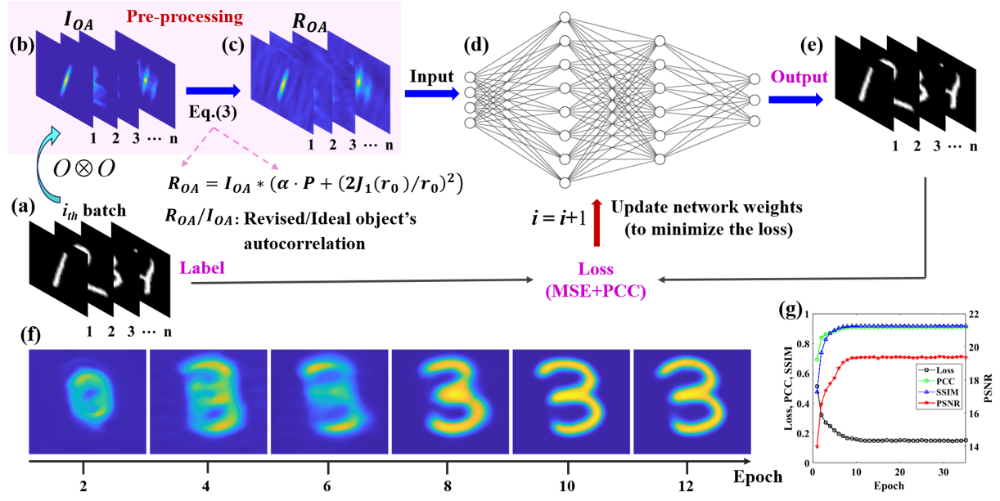

# Simulation-trained neural network
This repository contains the codes for paper ***Simulation-trained neural network for real-time and non-invasive imaging through scattering media*** by Zhao Wang, Youwei Liu, Anda Shi.

## Results

Fig. 1 Model and method for training the ST-Unet using simulation data. 

## Usage
### Download the repository and model file
0. Requirements are Python 3.8 and Pytorch 2.0 
1. Download this repository via git
2. Run **STUnet_reconstruct.ipynb** to do reconstruction of one speckle.
